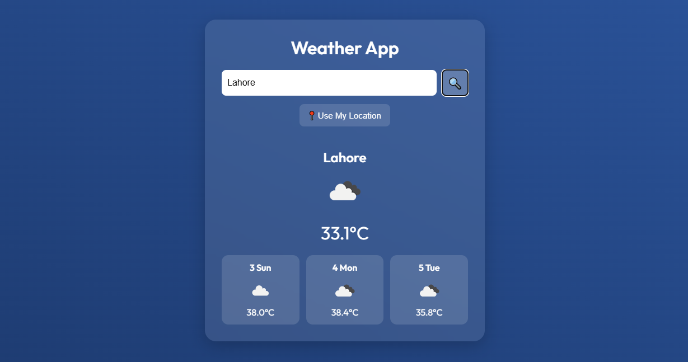

# 🌤️ Weather Dashboard

A sleek and responsive real-time weather app built using HTML, CSS, and JavaScript.  
Search for any city or use your current location to view live weather updates and a 3-day forecast.



---

## 🔧 Features

- 🔍 Search by City Name  
- 📍 Get Weather using Geolocation  
- 🌡️ Live temperature and conditions  
- 🧭 3-day weather forecast  
- ⚡ Responsive and animated design  
- 📉 Loading spinner for better UX  
- 🛡️ Secure API key management via `config.js`

---

## 🚀 Live Demo

**GitHub Pages:**  
[https://4h-m3d.github.io/weather-dashboard](https://4h-m3d.github.io/weather-dashboard)

---

## 🛠️ Setup Instructions

1. **Clone this repository:**
   ```bash
   git clone https://github.com/4h-m3d/weather-dashboard.git
   cd weather-dashboard
   ```

2. **Create a `config.js` file in the root directory:**
   ```js
   const OPENWEATHER_API_KEY = "your_openweather_api_key";
   ```

3. **Open `index.html` in your browser.**  
   You're all set!

---

## 🧱 Tech Stack

- HTML5  
- CSS3 (Flexbox/Grid + Animations)  
- JavaScript (ES6)  
- OpenWeatherMap API  
- Geolocation API

---

## 🔮 Future Upgrades

- 📅 Hourly forecast integration  
- 🌍 Map view with weather overlays  
- 🎨 Theme toggling (dark/light)  
- 💬 Multilingual support  
- 📲 PWA support for offline use  
- 🔔 Weather alerts and notifications

---

## 🙏 Credits

- Weather data by [OpenWeatherMap](https://openweathermap.org/)  
- Icons from [OpenWeatherMap Icons](https://openweathermap.org/weather-conditions)  
- Developed by [Ahmed Nadeem](https://github.com/4h-m3d)

---


## 📄 License

Directed by: **Ahmed Nadeem**

---
